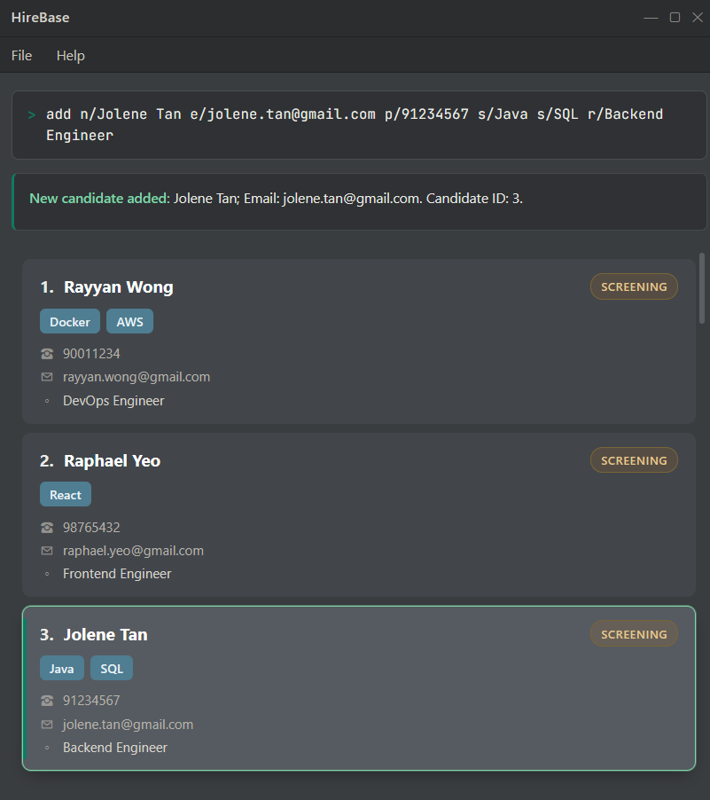

AddressBook Level 3 (AB3) is a **desktop application for managing contacts, optimized for use through a Command Line Interface (CLI)** while retaining the benefits of a Graphical User Interface (GUI). If you type quickly, AB3 can help you manage contacts faster than traditional GUI applications.

- Table of Contents
  {:toc}

---

## Quick start

1. Ensure that Java `25` or later is installed on your computer. 
   **Mac users:** Ensure you have the precise JDK version prescribed [here](https://se-education.org/guides/tutorials/javaInstallationMac.html).

1. Download the latest `.jar` file from [here](https://github.com/se-edu/addressbook-level3/releases).

1. Copy the file to the folder you want to use as the _home folder_ for your AddressBook.

1. Open a terminal, `cd` to the folder containing the JAR file, and run `java -jar addressbook.jar`. 
   A GUI similar to the one below should appear in a few seconds. Note how the app contains some sample data. 
   

1. Type a command in the command box and press Enter to execute it. For example, type **`help`** and press Enter to open the help window. 
   Some example commands you can try:
   - `list` : Lists all contacts.

   - `add n/John Doe p/98765432 e/johnd@example.com a/John street, block 123, #01-01` : Adds a contact named `John Doe` to the Address Book.

   - `delete candidate 3` : Deletes the 3rd candidate shown in the current list.

   - `clear` : Deletes all contacts.

   - `exit` : Exits the app.

1. Refer to the [Features](#features) section below for details of each command.

---

## Features

**:information_source: Notes about the command format:** 

- Words in `UPPER_CASE` are the parameters to be supplied by the user. 
  For example, in `add n/NAME`, replace `NAME` with a value such as `John Doe`.

- Items in square brackets are optional. 
  For example, `n/NAME [t/TAG]` can be used as `n/John Doe t/friend` or as `n/John Doe`.

- Items followed by `…`​ can appear zero or more times. 
  For example, `[t/TAG]…​` may be omitted, or written as `t/friend` or `t/friend t/family`.

- Parameters can be in any order. 
  For example, if the command specifies `n/NAME p/PHONE_NUMBER`, `p/PHONE_NUMBER n/NAME` is also acceptable.

- Extraneous parameters for commands that take no parameters, such as `help`, `list`, `exit`, and `clear`, are ignored. 
  For example, `help 123` is interpreted as `help`.

- If you are using a PDF version of this document, be careful when copying and pasting commands that span multiple lines as space characters surrounding line-breaks may be omitted when copied over to the application.

### Viewing help: `help`

Shows a message explaining how to access the help page.

Format: `help`

### Adding a person: `add`

Adds a person to the address book.

Format: `add n/NAME p/PHONE_NUMBER e/EMAIL a/ADDRESS [t/TAG]…​`

:bulb: **Tip:**
A person can have any number of tags, including zero.

Examples:

- `add n/John Doe p/98765432 e/johnd@example.com a/John street, block 123, #01-01`
- `add n/Betsy Crowe t/friend e/betsycrowe@example.com a/Newgate Prison p/1234567 t/criminal`

### Listing all persons: `list`

Shows a list of all persons in the address book.

Format: `list`

### Editing a candidate: `edit candidate`

Updates the candidate at the positive `INDEX` shown in the current list, including a list narrowed by `find`.
After a successful edit, the full list is displayed again.

Format: `edit candidate INDEX [n/NAME] [e/EMAIL] [p/PHONE] [s/SKILL]… [r/ROLE] [a/ADDRESS] [t/TAG]…`

`candidate` is a required, case-sensitive keyword. The old `edit INDEX ...` syntax is rejected.
Multiple spaces between command words are accepted.

Supply at least one field. Omitted fields retain their existing values. Supplying `s/` replaces the entire skill set;
repeat it to supply multiple skills. Skills are optional: use `edit candidate INDEX s/` to clear them.
When supplying multiple skills, each value must be non-blank.
Repeated skills are combined without regard to case. A repeated single-value prefix such as `r/` is rejected.

For example, `edit candidate 1 s/` removes all skills from the first displayed candidate. Mixing an empty skill with a
non-empty skill, as in `edit candidate 1 s/ s/new skill`, is rejected and leaves the candidate's entire record unchanged.
To replace all existing skills with just "new skill", use `edit candidate 1 s/new skill`.
Omitting `s/` entirely preserves the candidate's existing skills.

Names accept 1–100 characters consisting of letters, spaces, hyphens and apostrophes. Phone numbers accept 3–15 digits,
with an optional leading `+`. Emails must have a valid email format and must not match another candidate's email,
ignoring case. Candidates may share the same name. Changing only the case of a candidate's own email is allowed.

Skills accept 1–30 characters consisting of letters, digits, spaces and `+`, `#`, `.`, `/`.
Target roles accept 1–100 characters consisting of letters, digits, spaces, hyphens and slashes, and cannot be blank.
Leading and trailing whitespace is trimmed, and consecutive whitespace in names, skills and roles is collapsed.
Invalid input leaves the records unchanged.

For example, `edit candidate 1 p/+6591234567 e/johndoe@example.com` updates only the first displayed candidate's contact details.
`edit candidate 2 s/Java s/SQL r/Backend Engineer` replaces the second displayed candidate's skills and target role,
preserving their contact details. Edited recruitment details appear on the candidate card and are saved locally.
Older records without skills or a target role can still be loaded and edited.

The existing address and tag fields remain supported. Supplying tags replaces the entire tag set;
`t/` with no value clears tags.

### Locating persons by name: `find`

Finds persons whose names contain any of the given keywords.

Format: `find KEYWORD [MORE_KEYWORDS]`

- The search is case-insensitive; for example, `hans` matches `Hans`.
- Keyword order does not matter; for example, `Hans Bo` matches `Bo Hans`.
- The search considers only names.
- Only full words match; for example, `Han` does not match `Hans`.
- Persons matching at least one keyword are returned (an `OR` search); for example, `Hans Bo` returns `Hans Gruber` and `Bo Yang`.

Examples:

- `find John` returns `john` and `John Doe`
- `find alex david` returns `Alex Yeoh`, `David Li` 
  

### Deleting a candidate: `delete candidate`

Deletes the specified candidate from the address book.

Format: `delete candidate INDEX`

- The `candidate` record-type keyword is required and case-sensitive.
- Deletes the candidate at the specified `INDEX`.
- The index refers to the index number shown in the displayed candidate list.
- The index **must be a positive integer** 1, 2, 3, …​

Examples:

- `list` followed by `delete candidate 2` deletes the 2nd candidate in the address book.
- `find Betsy` followed by `delete candidate 1` deletes the 1st candidate in the results of the `find` command.

### Clearing all entries: `clear`

Clears all entries from the address book.

Format: `clear`

### Exiting the program: `exit`

Exits the program.

Format: `exit`

### Saving the data

HireBase automatically saves data after every command. You do not need to save manually.

### Editing the data file

HireBase data is saved automatically as a JSON file `[JAR file location]/data/addressbook.json`. Advanced users are welcome to update data directly by editing that data file.

:exclamation: **Caution:**
If your changes make the data file invalid, HireBase starts with an empty address book at the next run. The invalid file remains on disk until you run a command (HireBase saves after every command). Still, we recommend backing up the file before editing it. 
Furthermore, certain edits can cause the HireBase to behave in unexpected ways (e.g., if a value entered is outside of the acceptable range). Therefore, edit the data file only if you are confident that you can update it correctly.

### Archiving data files `[coming in v2.0]`

_Details coming soon ..._

---

## FAQ

**Q**: How do I transfer my data to another computer? 
**A**: Install the app on the other computer and overwrite the data file it creates with the data file from your previous HireBase home folder.

---

## Known issues

1. **When using multiple screens**, if you move the application to a secondary screen, and later switch to using only the primary screen, the GUI will open off-screen. The remedy is to delete the `preferences.json` file created by the application before running the application again.
2. **If you minimize the Help Window** and then run the `help` command (or use the `Help` menu, or the keyboard shortcut `F1`) again, the original Help Window will remain minimized, and no new Help Window will appear. The remedy is to manually restore the minimized Help Window.

---

## Command summary

| Action     | Format, Examples                                                                                                                                                      |
| ---------- | --------------------------------------------------------------------------------------------------------------------------------------------------------------------- |
| **Add**    | `add n/NAME p/PHONE_NUMBER e/EMAIL a/ADDRESS [t/TAG]…​`   e.g., `add n/James Ho p/22224444 e/jamesho@example.com a/123, Clementi Rd, 1234665 t/friend t/colleague` |
| **Clear**  | `clear`                                                                                                                                                               |
| **Delete** | `delete candidate INDEX`  e.g., `delete candidate 3`                                                                                                               |
| **Edit**   | `edit candidate INDEX [n/NAME] [e/EMAIL] [p/PHONE] [s/SKILL]… [r/ROLE] [a/ADDRESS] [t/TAG]…`  e.g., `edit candidate 2 n/James Lee e/jameslee@example.com`                                          |
| **Find**   | `find KEYWORD [MORE_KEYWORDS]`  e.g., `find James Jake`                                                                                                            |
| **List**   | `list`                                                                                                                                                                |
| **Help**   | `help`                                                                                                                                                                |
